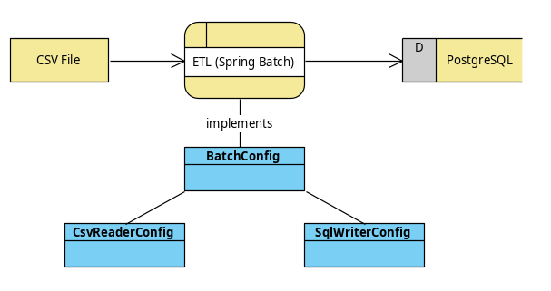
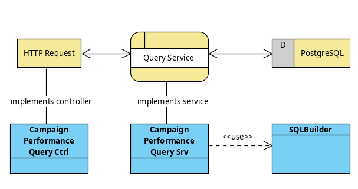

= Adverity Challenge - Simple Data Warehouse

== Quickstart

In order to get the project up and running, enter
`docker/compose/asdw-localdev` and do a `docker-compose up`:

[source,bash]
----
~$ cd docker/compose/asdw-localdev
~/docker/compose/asdw-localdev$ docker-compose up -d
----

You can verify everything worked by trying a query:

http://172.36.59.52:8080/campaignPerformance?metrics=total_clicks,total_impressions,total_ctr&aggregates=datasource,campaign

== Development mode

You can open this project in IntelliJ idea and create
a Spring Boot Run Configuration as follows:

- Name: QueryWebApp
- Main class: `com.adverity.konfilios.asdw.AsdwWebApp`
- Use classpath of module: `adverity-simple-data-warehouse`
- Active profiles: `asdw-localdev-docker`

The last setting configures a datasource that connects to the
docker-compose postgresql container created in the previous
section.

== Campaign Performance Query API

=== Request
The Campaign Performance Query API offers a `/campaignPerformance'
API which can be consumed via a `GET` *request* and the following
optional parameters:

|===
|Parameter |Data Type |Description

|*metrics*
|`List<String>`
|Metrics to be returned. Allowed values are
`total_clicks`, `total_impressions`, `total_ctr`

|*aggregates*
|`List<String>`
|Dimensions to group by. Allowed values are
`datasource`, `campaign`, `date`

|*sorts*
|`List<String>`
|Metrics or dimensions to order by. Allowed values are
`datasource`, `campaign`, `date`, `total_clicks`,
`total_impressions`, `total_ctr`.
Make sure all sort columns are also included in the
*metrics* and/or *aggregates* fields, otherwise the
query will not be executable.

|*offset*,*limit*
|`Integer`
|Offset and limit for the query result set. If no
values are passed, an offset of 0 and a limit of 100
is assumed.

|*filterDatasources*
|`List<String>`
|Names of datasources to which the results will be
restricted. Datasources need to be urlencoded if they
contain special characters (whitespace, etc.)

|*filterCampaigns*
|`List<String>`
|Names of campaigns to which the results will be
restricted. Campaigns need to be urlencoded if they
contain special characters (whitespace, etc.)

|*filterDateStart*
|`Date`
|Filter only records with dates equal or later than
the passed date. Use YYYY-mm-dd format.

|*filterDateEnd*
|`Date`
|Filter only records with dates equal or earlier than
the passed date. Use YYYY-mm-dd format.
|===

All `filterXXX` predicates are combined with an `AND`, so
adding filters restricts the queried dataset.

For implementation details, please refer to `com.adverity.konfilios.asdw.query.web.CampaignPerformanceQueryCtrl.executeQuery()`
HTTP controller method.

=== Response

Since this is a demo service, the response contains the following fields

|===
|Field |Data Type |Description

|*sql*
|`String`
|The actual SQL statement that was executed.

|*query*
|`CampaignPerformanceQuery`
|The query parameters provided in the request

|*records*
|List<Record>
|The actual list of records. The fields will vary depending
on the *metrics* and *aggregates* defined in the request.
|===

== Test Queries

IntelliJ IDEA offers an https://www.jetbrains.com/help/idea/http-client-in-product-code-editor.html[http client].
You can find some test HTTP queries in link:tests/queries.http[tests/queries.http]

Below are some example queries.

=== Total Clicks for a given Datasource for a given Date range

Request (http://172.36.59.52:8080/campaignPerformance?metrics=total_clicks&filterDatasources=Facebook%20Ads&filterDateStart=2019-07-01&filterDateEnd=2019-07-15&aggregates=datasource[click to execute on docker]):

[source,http]
----
GET http://172.36.59.52:8080/campaignPerformance
   ?metrics=total_clicks
   &filterDatasources=Facebook%20Ads
   &filterDateStart=2019-07-01
   &filterDateEnd=2019-07-15
   &aggregates=datasource
----

Response
[source,json]
----
{
  "sql": "SELECT datasource, SUM(clicks) AS total_clicks \n                FROM campaign_daily_performance \n                 WHERE datasource IN (:datasources) AND date >= (:dateStart) AND date <= (:dateEnd) \n                 GROUP BY datasource\n                \n                \n                LIMIT 100",
  "query": {
    "metrics": [
      "total_clicks"
    ],
    "aggregates": [
      "datasource"
    ],
    "sorts": [],
    "filterDatasources": [
      "Facebook Ads"
    ],
    "filterCampaigns": [],
    "filterDateStart": "2019-07-01",
    "filterDateEnd": "2019-07-15",
    "offset": null,
    "limit": null
  },
  "records": [
    {
      "datasource": "Facebook Ads",
      "total_clicks": "8353"
    }
  ]
}
----

=== Click-Through Rate (CTR) per Datasource and Campaign

Request (http://172.36.59.52:8080/campaignPerformance?metrics=total_ctr&aggregates=datasource,campaign&sorts=total_ctr%20desc&limit=5[click to execute on docker]):

[source,http]
----
GET http://172.36.59.52:8080/campaignPerformance
   ?metrics=total_ctr
   &aggregates=datasource,campaign
   &sorts=total_ctr%20desc
   &limit=5
----

Notes:

1. Results are ordered by descending total_ctrl
2. A limit of 5 was set of brevity and readability

Response:
[source,json]
----
{
  "sql": "SELECT datasource, campaign, (CAST(SUM(clicks) AS NUMERIC)/SUM(impressions)) AS total_ctr \n                FROM campaign_daily_performance \n                 \n                 GROUP BY datasource, campaign\n                 ORDER BY total_ctr desc\n                \n                LIMIT 5",
  "query": {
    "metrics": [
      "total_ctr"
    ],
    "aggregates": [
      "datasource",
      "campaign"
    ],
    "sorts": [
      "total_ctr desc"
    ],
    "filterDatasources": [],
    "filterCampaigns": [],
    "filterDateStart": null,
    "filterDateEnd": null,
    "offset": null,
    "limit": 5
  },
  "records": [
    {
      "datasource": "Twitter Ads",
      "campaign": "SN_KochAbo",
      "total_ctr": "0.48248279976879906028"
    },
    {
      "datasource": "Twitter Ads",
      "campaign": "SN_Brand",
      "total_ctr": "0.45573123180883978455"
    },
    {
      "datasource": "Twitter Ads",
      "campaign": "AT|SN|Brand",
      "total_ctr": "0.41847451790633608815"
    },
    {
      "datasource": "Twitter Ads",
      "campaign": "SN_Brand Produkte",
      "total_ctr": "0.41177331698658712877"
    },
    {
      "datasource": "Twitter Ads",
      "campaign": "DE|SN|Brand",
      "total_ctr": "0.40226720647773279352"
    }
  ]
}
----

=== Total Impressions over time (daily)

Request (http://172.36.59.52:8080/campaignPerformance?metrics=total_impressions&aggregates=date&sorts=date&limit=5[click to execute on docker]):

[source,http]
----
GET http://172.36.59.52:8080/campaignPerformance
   ?metrics=total_impressions
   &aggregates=date
   &sorts=date
   &limit=5
----

Notes:

1. Results are ordered by ascending date
2. A limit of 5 was set of brevity and readability

Response:
[source,json]
----
{
  "sql": "SELECT date, SUM(impressions) AS total_impressions \n                FROM campaign_daily_performance \n                 \n                 GROUP BY date\n                 ORDER BY date asc\n                \n                LIMIT 5",
  "query": {
    "metrics": [
      "total_impressions"
    ],
    "aggregates": [
      "date"
    ],
    "sorts": [
      "date"
    ],
    "filterDatasources": [],
    "filterCampaigns": [],
    "filterDateStart": null,
    "filterDateEnd": null,
    "offset": null,
    "limit": 5
  },
  "records": [
    {
      "date": "2019-01-01",
      "total_impressions": "81395"
    },
    {
      "date": "2019-01-02",
      "total_impressions": "112810"
    },
    {
      "date": "2019-01-03",
      "total_impressions": "100903"
    },
    {
      "date": "2019-01-04",
      "total_impressions": "93786"
    },
    {
      "date": "2019-01-05",
      "total_impressions": "87371"
    }
  ]
}
----

== Architecture

The application consists of two major components:

1. The ETL job which ingests data from a CSV file into a PostgreSQL database
2. The Query service which queries the PostgreSQL database

=== ETL Job

The ETL job is a set of https://spring.io/projects/spring-batch[Spring Batch]
components:

1. A CSV Reader which is configured in `com.adverity.konfilios.asdw.etl.batch.CsvReaderConfig`
2. A JDBC Writer which is configured in `com.adverity.konfilios.asdw.etl.batch.SqlWriterConfig`

The two components are wired together in `com.adverity.konfilios.asdw.etl.batch.BatchConfig`

The job is executed on application startup.

Spring Batch automatically creates its own `batch_XXX`
metadata tables which maintain job execution state.

=== Query Service

The query service accepts a set of optional parameters modeled
in `com.adverity.konfilios.asdw.query.services.CampaignPerformanceQuery`
and uses an `com.adverity.konfilios.asdw.query.services.sqlbuilder.SqlBuilder`
in order to create an execute an SQL statement.

The service is exposed to external HTTP clients via
the `com.adverity.konfilios.asdw.query.web.CampaignPerformanceQueryCtrl`
HTTP controller (Spring Web).

=== Database schema

The application consists of a single table `campaign_daily_performance`.
It is populated at application startup via https://www.liquibase.org/[liquibase]
migration script `src/main/resources/db/changelog/0001-campaign_daily_performance.xml`

The resulting DDL is the following:

[source,sql]
----
create table campaign_daily_performance
(
	id integer generated by default as identity
		constraint campaign_daily_performance_pkey
			primary key,
	datasource varchar(127) not null,
	campaign varchar(127) not null,
	date date not null,
	clicks integer not null,
	impressions integer not null,
	constraint campaign_daily_performance_natural_key_unique
		unique (datasource, campaign, date)
);
----

Note that liquibase automatically creates its own
metadata tables `databasechangelockXXX`.
